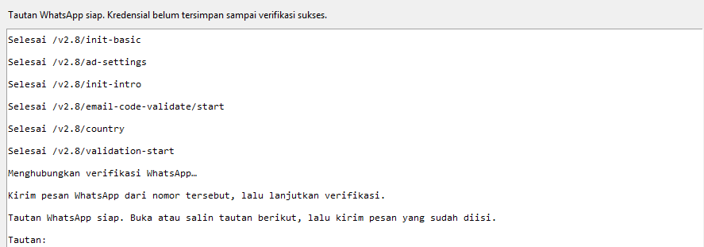

# GetContact Desktop Engine

> Core research oleh @mfajarb. Versi ini di-*re-engineer* dan diperbaiki oleh
> @falihputraaaa / `@prnce______`.
>fork ini fix verifykit initialization issues (403) dan menambahkan UI untuk memudahkan.


(error: vfk init failed: HTTP 403 telah di-fix)

GetContact Desktop adalah project Python dengan desktop interface yang memakai engine lokal untuk berkomunikasi dengan API GetContact, tanpa browser.

Project ini dibuat sebagai **research dan learning project** untuk memahami bagaimana aplikasi mobile berkomunikasi dengan backend service serta bagaimana proses autentikasi dan request API bekerja.

Untuk arsitektur, API publik `engine.py`, struktur kredensial, dan panduan membuat UI baru, baca [ENGINE.md](ENGINE.md).

## Features

Yang bisa dilakukan:

- melihat informasi sebuah nomor (nama yang ditampilkan oleh GetContact, jumlah tag, email jika tersedia)
- melihat daftar tag sebuah nomor berdasarkan data yang tersedia dari service
- melihat sisa kuota pencarian profil dan tag, serta tanggal perpanjangannya

Hasil lookup ditampilkan langsung di aplikasi.

---

## ⚠️ Disclaimer

Project ini adalah **independent research project** dan tidak berafiliasi, didukung, maupun berhubungan secara resmi dengan GetContact.

Tool ini dibuat untuk tujuan:
- pembelajaran teknis
- penelitian API communication
- eksplorasi bagaimana sebuah service bekerja

Pengguna bertanggung jawab penuh terhadap penggunaan tool ini.

Harap gunakan secara bertanggung jawab dan selalu menghormati:
- privasi pengguna lain
- peraturan yang berlaku
- Terms of Service dari layanan terkait

Project ini tidak ditujukan untuk:
- penyalahgunaan data pribadi
- pengumpulan data secara massal
- aktivitas yang merugikan pihak lain

---

## How It Works

Secara sederhana, flow kerja tool ini:

```
User Input
    |
    v
GetContact Desktop UI
    |
    v
Authenticated API Request
    |
    v
GetContact Service
    |
    v
Hasil di Desktop UI
```

Semua proses dilakukan dari sisi client dan hasil response diproses secara lokal.

Project ini tidak menyediakan server pihak ketiga, database terpusat, maupun shared account.

---

## Credential & Account Safety

Tool ini membutuhkan kredensial akun milik pengguna sendiri.

Beberapa hal yang perlu diperhatikan:

- Jangan membagikan token/session credential kepada orang lain.
- Jangan commit file credential ke repository publik.
- Gunakan akun testing terpisah jika diperlukan.
- Jangan menyimpan credential di screenshot atau forum publik.

Credential adalah tanggung jawab masing-masing pengguna.

---

## Data & Privacy

Project ini tidak secara sengaja mengumpulkan atau menyimpan data pengguna pada server eksternal.

Namun, pengguna tetap perlu memperhatikan bahwa:

- hasil lookup harus diperlakukan secara bertanggung jawab

Jangan mendistribusikan informasi pribadi tanpa izin.

---

## Limitations

Perlu dipahami bahwa:

- API dapat berubah sewaktu-waktu.
- Akun dapat terkena pembatasan jika melakukan request berlebihan.
- Hasil yang diberikan bergantung pada availability service.
- Project ini bukan official client dari GetContact.

---

## Contributing

Pull request dan feedback sangat diterima.

Jika menemukan masalah security, harap jangan langsung mempublikasikan detail sensitif pada issue.

Silakan gunakan responsible disclosure agar masalah dapat ditinjau terlebih dahulu.

---

## Kebutuhan

Python 3.9 atau lebih baru, dan dua paket:

```bash
python -m pip install -r requirements.txt
```

Sudah diuji di Windows (git-bash) dan Linux. Tidak ada langkah build, tidak ada file konfigurasi yang perlu diedit.

## Menjalankan

### Mode desktop UI

Untuk menggunakan aplikasi desktop, jalankan:

```bash
python gtc_ui.py
```

UI memakai `engine.py` dan kredensial aktif dari penyimpanan lokal. Melalui tombol **Kelola akun**,
Anda dapat melihat akun yang tersimpan, memilih akun aktif, menambahkan kredensial yang dimiliki,
atau memulai verifikasi WhatsApp. Saat proses registrasi menghasilkan `clientDeviceId`, `finalKey`,
dan `token`, ketiganya tampil di wizard; akun baru hanya disimpan setelah verifikasi selesai.

Semua nomor dinormalkan ke format E.164 dengan asumsi Indonesia: `08…` menjadi `+628…`, `62…`
menjadi `+62…`, dan nomor yang sudah diawali `+` dibiarkan apa adanya.

## Kredensial

Kredensial disimpan di `~/.config/gtc/credentials.json` dengan permission `600` di sistem POSIX.
Isinya token, `finalKey` hasil pertukaran Diffie-Hellman, dan `clientDeviceId` — tiga hal yang cukup
untuk memakai akun GetContact, jadi perlakukan file ini seperti password.

UI memakai kredensial aktif yang sudah tersimpan secara lokal.

Lokasi penyimpanan bisa dipindah lewat `GTC_CONFIG_DIR`.

## Variabel lingkungan

| Variabel | Fungsi |
| --- | --- |
| `GTC_CONFIG_DIR` | Lokasi `credentials.json`. Default `~/.config/gtc`. |

## Cara kerjanya

Klien ini meniru aplikasi Android GetContact 8.4.0. Setiap permintaan:

1. Payload JSON dienkripsi AES-256-ECB memakai `finalKey` milik akun, lalu dikirim sebagai
   `{"data": "<base64>"}`.
2. Header `x-req-signature` berisi HMAC-SHA256 dari `<timestamp>-<payload mentah>` dengan kunci
aplikasi yang tetap.
3. Respons yang punya field `data` didekripsi dengan kunci yang sama sebelum di-parse.

`finalKey` sendiri lahir dari pertukaran Diffie-Hellman saat registrasi: klien mengirim kunci
publiknya, server membalas dengan miliknya, dan SHA-256 dari shared secret menjadi kunci AES-nya.
Parameter DH (`p = 900719898367`, `g = 7`) sudah tertanam di kode dan terverifikasi.

Dua endpoint dipakai untuk lookup, dan penamaannya menyesatkan: `/v2.8/search` mengembalikan **profil**, sementara `/v2.8/number-detail` mengembalikan **daftar tag**. Pemetaan ini pernah tertukar dan sekarang sudah diluruskan di `api_search()`.

Registrasi memakai VerifyKit (`api.verifykit.com`) sebagai penyedia verifikasi, dengan skema HMAC dan AES yang serupa tapi memakai kunci berbeda.

## Batasan

- Default negara adalah Indonesia (`COUNTRY = "id"`). Nomor luar negeri harus ditulis lengkap dengan
  `+kode negara`, dan sebagian respons mungkin tidak sesuai.
- Kuota pencarian mengikuti langganan akun. Habis kuota berarti error, bukan hasil kosong.
- Permintaan yang terlalu cepat dapat memicu captcha atau pembatasan akun.
- Kunci HMAC dan versi aplikasi bersifat statis. Kalau GetContact mengganti keduanya, konstanta di `engine.py` harus diperbarui.

## Notes

Alat ini mengakses API privat GetContact dengan menyamar sebagai klien resminya, yang hampir melanggar syarat layanan mereka. Data yang dikembalikan juga data pribadi orang lain. Pakai untuk nomor yang memang berhak Anda periksa, patuhi aturan perlindungan data yang berlaku, dan tanggung sendiri resikonya. Tidak ada afiliasi dengan GetContact dan pihak manapun. #DWYOR
